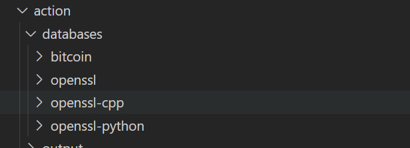
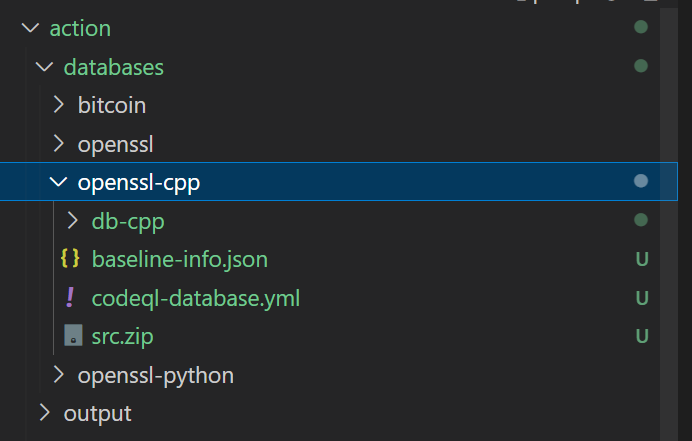
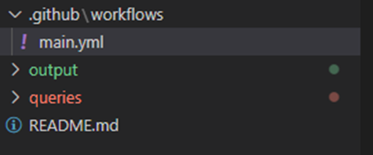

# QCVE - Code Scanning Example

This action analyze submitted CodeQL Query against Pre-defined Databases from public project, and return sarif report to folder

## Example usage

```
name: CodeQL Scan
id: scan
uses: pqcee/QCVE-action@v1.0.0
with:
  username: 'john'
  report: '${{ github.workspace }}/output/john'
  query: '${{ github.workspace }}/queries/john'
  database: 'openssl'
  number: 1

```

## Inputs

- `username`: the name of the owner of the query.
- `report`: location of generated sarif report.
- `query`: location of submitted query.
- `database`: selected database to analyze.
- `number`: unique request number


## Available databases

- `openssl`: database languange `javascript`.
- `bitcoin`:  database languange `javascript`.

## Add New Database

- Create new folder inside `action/databases` directory with following format name `{project-name}-{language}` for example `openssl-cpp`
    

- Go to your project root directory _(the project that you want to generate QL Database from it)_, and run CodeQL CLI command to generate new database
  ```
  codeql database create ./database --language=cpp
  ```

- Open folder database inside your project directory, copy all generated database content to `action/databases/openssl-cpp` directory
    

- For better documentation, please make sure you add your new database name to Readme.md file
    

- Commit, add new Tag and push changes back to repository.
  ```
  git add .
  git commit -m “commit message”
  git push origin
  git tag v1.0.1
  git push origin v1.0.1
  ```

- You need to update your workflow step inside [qcve runner repository](https://github.com/pqcee/qcve-runner), open `.github/workflows/main.yml`
    

- Find section called `CodeQL Scan`, change the tag version of the Action to match tag you add previously

    

- Next, you can try to add new query to analyze Your new database